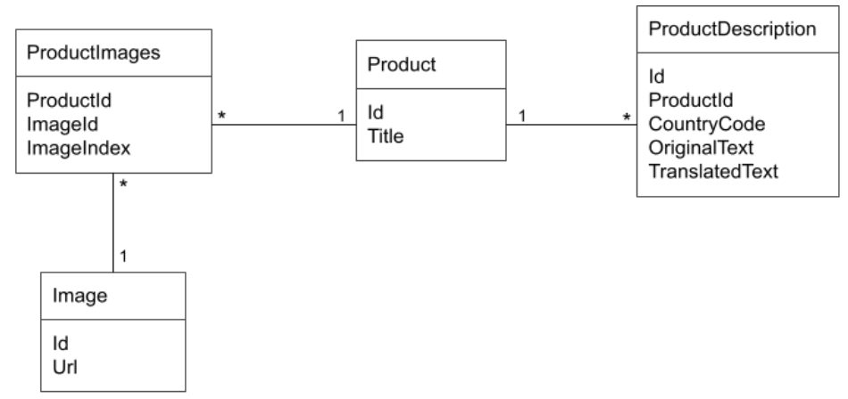

# CI/CD and deployment plan for the final model, in a cloud based production environment

<p align="center">
         
</p>

NOTE: The deployment plan has been developed for an AWS solution.

<p align="center">
         
</p>

## 1. Input Validation workflow

The process starts with the raw image data being stored in an S3 bucket. The data is then processed by a step function that checks the image format and other possible errors, via Lambda function. If there are no errors, the images are stored in a new S3 bucket. If there are errors, the images are stored in an S3 error folder. All the process is orchestrated by AWS Step Functions module.

## 2. Model Build - Continuous Integration (CI)

On the other hand, a SageMaker pipeline is created to perform:
* Data pre-processing (if needed)
* Model training
* Model evaluation on test data

To automatically build and test the code every time a Data Scientist/ML Engineer makes changes to the project, I use AWS Code Commit to host and manage the source code, and AWS CodeBuild to automatically compile and test code changes. When someone makes a change to the code in Code Commit, Code Build is triggered to ensure the changes are error-free. This continuous integration process is seamlessly integrated into the SageMaker pipeline, where ML models are trained, ensuring that any code modifications related to my SageMaker project are thoroughly tested and integrated.

## 3. Save into model registry

Once the machine learning model is trained, it is pushed into the SageMaker model registry, to enable easy version tracking and reusability. Additionally, the model is saved in an Amazon S3 bucket, providing reliable storage and accessibility for the trained model files, making them readily available for deployment and further analysis.

## 4. Continuous Deployment (CD)

Once the new model is registered, it is commited (approval required) and built to run the pipelines, using AWS Code Commit and Code Built. After approval, the code is deployed to a pre-production SageMaker endpoint. Finally, the code is deployed to a production SageMaker endpoint.

## 5. Save outputs

After deploying the new version, predicted images are classified and propertly stored into each folder, one for each class.

## 6. KPI Visualization and drift alert

Finally, predictions and performance metrics from the machine learning model are visualized and monitored through Amazon CloudWatch. However, in the event of a drift in model performance, such as a situation where the number of True Positives for a specific category falls below a predetermined threshold, a CloudWatch alarm is configured to automatically trigger a response. This response typically involves retraining the SageMaker pipeline, ensuring that the machine learning model stays accurate and effective by adapting to changing data patterns or performance issues, and maintaining the overall quality and reliability of the deployed model.

# SQL Relational Database

Let’s imagine that now you have to load the product images from our database along with some additional text features like the product description provided by the retailers. The data is stored in an SQL relational database (postgresql) with the following schema:

<p align="center">
         
</p>

Write a query (either in django ORM or in SQL) to extract, for every existing product, the following fields:
* Product. Title
* Image. Url for the images with the ImageIndex = 0. _ImageIndex field states the priority order of images of a certain product. So for a given ProductId, the image with ImageIndex = 0 would be the most relevant image for that product_
* ProductDescription. TranslatedText if exists, else ProductDescription.OriginalText for ProductDescriptions in CountryCode = ‘us’


```
SELECT
    p.Title AS Product_Title,
    i.Url AS Image_Url,
    COALESCE(pd_description.TranslatedText, pd_original.OriginalText) AS Product_Description
FROM Product p
LEFT JOIN ProductImages pr ON p.id = pr.ProductId
LEFT JOIN Image i ON pr.ImageId = i.Id
LEFT JOIN ProductDescription pd_description ON p.Id = pd_description.ProductId
WHERE ProductImages.ImageIndex = 0
AND ProductDescription.CountryCode = 'us';
```

