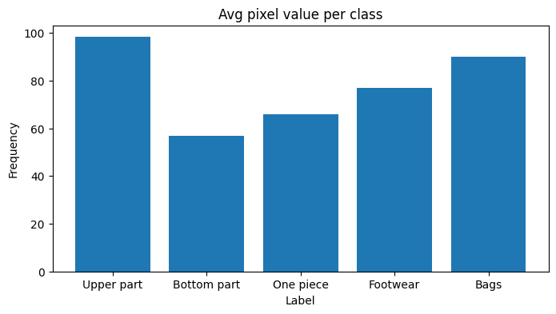
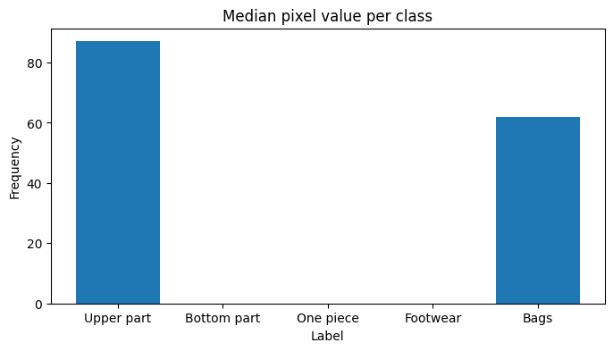

# Zalando
Automatic classification of fashion images (by [Zalando](https://github.com/zalandoresearch/fashion-mnist)) via Deep Learning

<p align="center">
         
</p>

- Table of contents
  * [Description and objective](#description-and-objective)
  * [Data Understanding and Exploratory Data Analysis (EDA)](#data-understanding-and-exploratory-data-analysis--eda-)
  * [Deep Learning Experimentation and Metrics](#deep-learning-experimentation-and-metrics)
    + [Train-Validation Split](#train-validation-split)
    + [Standarize Features](#standarize-features)
    + [Image Resizing](#image-resizing)
    + [Experimentation](#experimentation)
    + [Evaluation metrics](#evaluation-metrics)
      - [Classical Metrics](#classical-metrics)
    + [Performance Metrics](#performance-metrics)
    + [Resource Consumption Metrics](#resource-consumption-metrics)
  * [Conclusions](#conclusions)
  * [CI/CD Deployment plan and Database](#ci-cd-deployment-plan)
  * [References](#references)


## Description and objective

The original Zalando dataset contains 10 different labels:

0. __T-shirt/top__
1. __Trouser__
2. __Pullover__
3. __Dress__
4. __Coat__
5. __Sandal__
6. __Shirt__
7. __Sneaker__
8. __Bag__
9. __Ankle boot__

In this case, I want to group the original labels in 5 new labels with the following mapping between them:

* __Upper part__: T-shirt/top + Pullover + Coat + Shirt
* __Bottom part__: Trouser
* __One piece__: Dress
* __Footwear__: Sandal + Sneaker + Ankle boot
* __Bags__: Bag


The goal of this exercise is to understand the dataset and experiment with deep learning techniques to train a classifier for the given grouped classes (Upper part, Bottom Part, One piece, Footwear and Bags).

## Data Understanding and Exploratory Data Analysis (EDA)

1. Fashion-MNIST is a dataset of Zalando's article images—consisting of:
* __A training set of 60,000 examples__
* __A test set of 10,000 examples__
* It shares the same image size and structure of training and testing splits.

2. Image size: __28x28__
3. Image type: __grayscale image__
4. Duplicated images: __no__
5. Label distribution: although original labels are balanced for both labels, new labels are unbalanced:

```
# -- Train data
Upper part     24000 -> (Represents 40 % of training data)
Footwear       18000 -> (Represents 30 % of training data)
One piece       6000 -> (Represents 10 % of training data)
Bottom part     6000 -> (Represents 10 % of training data)
Bags            6000 -> (Represents 10 % of training data)

# -- Test data
Upper part     4000 -> (Represents 40 % of training data)
Footwear       3000 -> (Represents 30 % of training data)
Bottom part    1000 -> (Represents 10 % of training data)
One piece      1000 -> (Represents 10 % of training data)
Bags           1000 -> (Represents 10 % of training data)
```

Both datasets have an identical distribution (important note for train-validation split) 

6. Pixels distribution
* Min value: 0
* Max value: 255

6.1. Average pixel distribution per group

<p align="center">
         
</p>

6.2. Median pixel distribution per group

<p align="center">
         
</p>

## Deep Learning Experimentation and Metrics

In this part, I will outline the key steps involved in the experimentation process for training a dataset. __These steps include data preprocessing and preparation, as well as considerations for model input requirements.__

### Train-Validation Split

One of the fundamental steps in training a machine learning or deep learning model is to divide the available dataset into two distinct subsets: the training set and the validation set. This split is essential for evaluating the model's performance and preventing overfitting. The split ratio is 80% for training and 20% for validation, __stratified by label column__.

### Standarize Features

Standardizing features is a crucial preprocessing step in most machine learning and deep learning tasks. It involves adjusting the scale of the data to have a mean of 0 and a standard deviation of 1. To do so, I computed the mean and standard deviation __from the training images__ and used these values to normalize the rest of datasets.

### Image Resizing

Many pre-trained image classification models require a fixed input size for processing images: 224 x 224. To meet this requirement, I resized the input images to the specified dimensions. This resizing process ensures that all images are compatible with the model's architecture and can be processed uniformly.

### Experimentation

In this part, I will continue discussing the experimentation process for training a dataset, specifically focusing on the steps involved in experimenting with different models.

* __MobileNetV2__: to begin the experimentation process, I selected MobileNetV2 as the baseline model: a lightweight and efficient neural network architecture, suitable when prioritizing inference speed.
 * **NOTE**: I froze all layers except the last one.

* __MobileNetV2 plus image augmentation__: in the second experiment, I aimed to improve the model's performance on the "One Piece" group by incorporating image augmentation techniques.
 * **NOTE**: I continued using the MobileNetV2 model from the first step.

* __MobileNetV2: finetuning the entire model__. In the third experiment, I decided to fine-tune the entire MobileNetV2 model, meaning that none of the layers were frozen (without applying image augmentation techniques)

* __Trying a Smaller Model (SqueezeNet)__: For the fourth and last experiment, I chose to investigate the use of a smaller model, specifically SqueezeNet: motivated by its compact architecture, making it efficient in terms of model size (without applying image augmentation techniques)

### Evaluation metrics

I continue to explore the experimentation process, focusing on the metrics used to evaluate the models. __The metrics are categorized into three types__:

#### Classical Metrics

* **Recall**: This metric was used to measure the model's ability to correctly identify true positives. It is especially valuable for understanding the model's performance in recall-sensitive scenarios where minimizing false negatives is crucial.
* **Precision**: Precision was employed to evaluate the model's accuracy in classifying true positives among the predicted positives. It allows us to assess the issue of false positives, particularly useful in scenarios where false positives can be costly.
* **Negative Predictive Value (NPV)**: NPV was used to gauge the percentage of true negatives correctly predicted by the model. This metric helps in assessing the model's ability to identify true negatives.

__NOTE__: The choice to use recall and precision separately (as opposed to the F1 score) enables a more granular understanding of the model's performance for each class. It helps determine whether the primary issue is false positives or false negatives. Additionally, can be considered a precision-recall curve.

|                  | recall | precision | negative predicted value | model |
|------------------|-------|-----------|--------------------------| -------- |
| Upper part       | 0.91  | 0.96      | 0.94                     | [MobileNetV2 baseline (no img aug) - frozen layers](https://github.com/AlbertoUAH/Zalando/blob/main/models/00_zalando_image_classification_mobilenet_v2_baseline_layers_frozen_no_img_aug.pth) |
|        | 0.89  | 0.94      | 0.93                     | [MobileNetV2 baseline (best img aug) - frozen layers](https://github.com/AlbertoUAH/Zalando/blob/main/models/01_zalando_image_classification_mobilenet_v2_baseline_layers_frozen_with_img_aug_no_erase.pth) |
|        | __0.96__  | __0.99__     | __0.97__                     | [MobileNetV2 baseline (no img aug) - non frozen layers](https://github.com/AlbertoUAH/Zalando/blob/main/models/02_zalando_image_classification_mobilenet_v2_baseline_non_layers_frozen.pth) |
|        | 0.94  | 0.97     | 0.96                     | [SqueezeNet1.1 baseline (no img aug) - non frozen layers](https://github.com/AlbertoUAH/Zalando/blob/main/models/03_zalando_image_classification_squeezenet1_1_baseline_non_layers_frozen.pth) |

|                  | recall | precision | negative predicted value | model |
|------------------|-------|-----------|--------------------------| -------- |
| Bottom part      | 0.96  | 0.97      | 1.0                      | MobileNetV2 baseline (no img aug) - frozen layers |
|     | 0.94  | 0.95      | 0.99                      | MobileNetV2 baseline (best img aug) - frozen layers |
|<font color="red">       | __0.99__  | __0.99__      | __1.0__                      | MobileNetV2 baseline (no img aug) - non frozen layers |</font>
|       | 0.97  | 0.98      | 1.0                      | SqueezeNet1.1 baseline (no img aug) - non frozen layers |

|                  | recall | precision | negative predicted value | model |
|------------------|-------|-----------|--------------------------| -------- |
| One piece        | 0.88  | 0.73      | 0.99                     | MobileNetV2 baseline (no img aug) - frozen layers |
|        | 0.8  | 0.67      | 0.98                     | MobileNetV2 baseline (best img aug) - frozen layers |
|        | __0.96__  | __0.86__      | __1.0__                     | MobileNetV2 baseline (no img aug) - non frozen layers |
|       | 0.89  | 0.81      | 0.99                      | SqueezeNet1.1 baseline (no img aug) - non frozen layers |

|                  | recall | precision | negative predicted value | model |
|------------------|-------|-----------|--------------------------| -------- |
| Footwear         | 0.99  | 0.99      | 1.0                      | MobileNetV2 baseline (no img aug) - frozen layers |
|         | 0.98  | 0.99      | 0.99                      | MobileNetV2 baseline (best img aug) - frozen layers |
|         | __1.0__  | __1.0__      | __1.0__                      | MobileNetV2 baseline (no img aug) - non frozen layers |
|       | 1.0  | 1.0      | 1.0                      | SqueezeNet1.1 baseline (no img aug) - non frozen layers |

|                  | recall | precision | negative predicted value | model |
|------------------|-------|-----------|--------------------------| -------- |
| Bags             | 0.96  | 0.92      | 1.0                      | MobileNetV2 baseline (no img aug) - frozen layers |
|             | 0.92  | 0.89      | 0.99                      | MobileNetV2 baseline (best img aug) - frozen layers |
|             | __0.99__  | __0.99__      | __1.0__                      | MobileNetV2 baseline (no img aug) - non frozen layers |
|       | 0.98  | 0.94      | 1.0                      | SqueezeNet1.1 baseline (no img aug) - non frozen layers |

### Performance Metrics

These performance metrics help determine whether the model can be deployed in batch/real-time scenarios:

* **Number of Parameters**
* **Model Size** (MB)
* **Inference Time** on test set

|                  | number of parameters | model size (MB) | test inference time (seconds) |
|------------------|-------|-----------|--------------------------|
| MobilenetV2 - baseline | 2230277 | 8.8 MB | 37.6 sec |
| MobilenetV2 - baseline - no frozen layers | 2230277 | 8.8 MB | 37.3 sec |
| SqueezeNet1.1 baseline (no img aug) - non frozen layers | 855109 | 3.3 MB | 35.7 sec |

### Resource Consumption Metrics

Evaluating resource consumption metrics is essential for optimizing hardware resources and minimizing energy costs when deploying the model in on-premise server environments.

* **CPU Power** (Watts)
* **GPU Power** (Watts)
* **RAM Power** (Watts)

|         |   cpu_power (W) |   gpu_power (W) |   ram_power (W) |
|--------:|------------:|------------:|------------:|
|       MobileNetV2 baseline (no img aug) - non frozen layers |        42.5 |     40.71 |      1.51 |
|       SqueezeNet1.1 baseline (no img aug) - non frozen layers |        42.5 |     34.23 |      1.51 |

## Conclusions

Based on the previous metrics, the "MobileNetV2 baseline (no img aug) - non frozen layers" and "SqueezeNet1.1 baseline (no img aug) - non frozen layers" models are the two potential candidates to be employed in a production environment. While both models achieve excellent results, MobileNetV2 slightly outperforms in the case of the "One Piece" label. __If the goal is to maximize correct classification, regardless of model size or complexity, MobileNetV2 is the preferred choice.__

## Future lines of research

1. __Review "One Piece" Mispredictions__
2. __Implement a GradCAM solution to analyse errors in detail__. [Source](https://medium.com/@stepanulyanin/implementing-grad-cam-in-pytorch-ea0937c31e82)
3. __Finetune SqueezeNet1_1 with data augmentation techniques__
4. __Create a Custom Convolutional Model__: it provides flexibility and control over the model's architecture
5. __Use Deeper Approaches__ (e.g., ResNet18): deeper architectures are capable of capturing more complex features and patterns, potentially leading to enhanced accuracy. With this architecture, Resource Consumption Metrics can be useful to determine whether this model performs better or not.


## CI/CD Deployment plan and Database

Find attached in [MLOps & Database README file](https://github.com/AlbertoUAH/Zalando/blob/main/MLOps%20%26%20Database.md)

## References

* [Fashion MNIST dataset, by Zalando](https://github.com/zalandoresearch/fashion-mnist)
* [Models and pretrained weights - PyTorch](https://pytorch.org/vision/stable/models.html)
* [How to check the number of parameters of a model? - PyTorch forum](https://discuss.pytorch.org/t/how-do-i-check-the-number-of-parameters-of-a-model/4325)
* [SqueezeNet: AlexNet-level accuracy with 50x fewer parameters and <0.5MB model size](https://arxiv.org/abs/1602.07360)
* [Torchvision: transforms](https://pytorch.org/vision/0.9/transforms.html)
* [Image examples with Shap library](https://shap.readthedocs.io/en/latest/image_examples.html)
* [CodeCarbon: Track and reduce CO2 emissions from your computing](https://codecarbon.io/)
* [AWS Documentation](https://docs.aws.amazon.com/)

